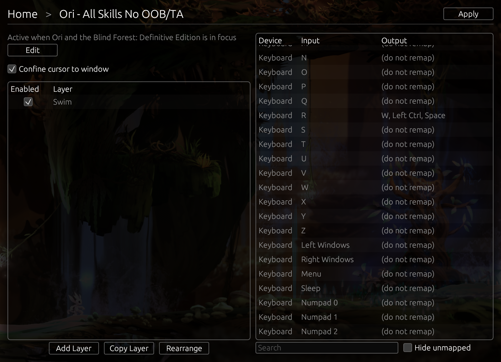

# Reemap

Simple, efficient input remaps

**[Website]**

**[Tutorial]**

Reemap is an input remapping tool for Windows with a focus on video games. It runs in the background
and remaps keyboard and mouse inputs.

Reemap was originally developed for [Ori] speedrunners who use input remaps.

Reemap is named after Reem, the spirit in [Ori and the Blind Forest][Ori] whose ancestral
tree grants Bash.

This repository contains the source code for Reemap.

### Escape Hatch

If you get stuck, **enable Scroll Lock** to temporarily disable remaps. ⚠️

## Features

- **Profiles** - remap inputs differently for each program
- **Layers** - conditionally override inputs in a profile
- **Keyboard and mouse** - freely map keyboard inputs to mouse inputs, and vice versa
- **Multi maps** - map one input to multiple outputs
- **Export and import profiles** - share or back up profiles
- **Confine cursor to window** - prevent the mouse from leaving the window (useful for fullscreen
games on multi-monitor setups)

The input remaps are implemented thoughtfully and from the perspective of using Reemap for video games.
For example, the software will not cause keys to get stuck as you switch layers. This is an issue
with some existing remap software.

Reemap does not support macros or any form of timed inputs.

## Installation

To install Reemap, download and run an installer.

You can find an installer here on the Github on the releases page, or you can go to the [website][Website].

## Compilation

To compile Reemap, you will need:
- [Rust]
- [Windows SDK]

Clone the repository. Then, in the repository root, run `cargo build --release`.

## License

Licensed under either of

- [Apache License, Version 2.0](LICENSE-APACHE)
- [MIT License](LICENSE-MIT)

at your option.

Note: Reemap includes an Ori screenshot subject to a different license. See below.

<small>

Ori and the Blind Forest: Definitive Edition © Microsoft Corporation. Reemap was created under Microsoft's ["Game Content Usage Rules"](https://www.xbox.com/en-US/developers/rules) using assets from Ori and the Blind Forest: Definitive Edition, and it is not endorsed by or affiliated with Microsoft.

</small>

[Ori]: https://www.orithegame.com/
[Rust]: https://www.rust-lang.org/
[Windows SDK]: https://developer.microsoft.com/en-us/windows/downloads/windows-sdk/
[Website]: https://reemap.mightyburger.net
[Tutorial]: https://reemap.mightyburger.net/tutorial
